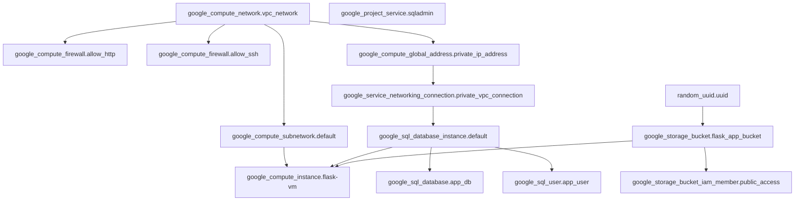
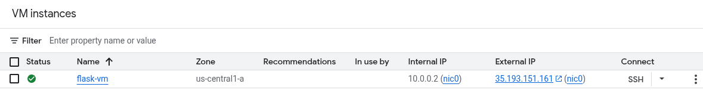
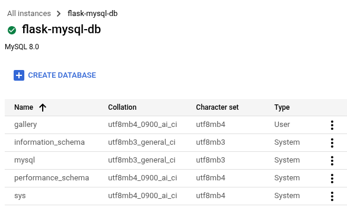
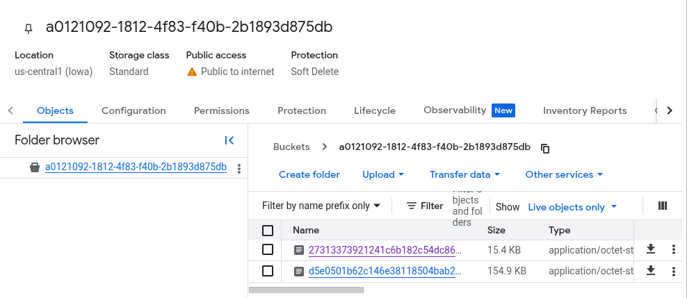
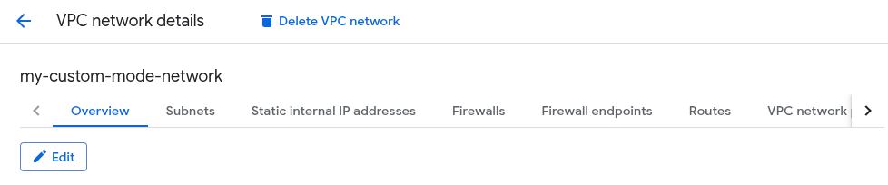
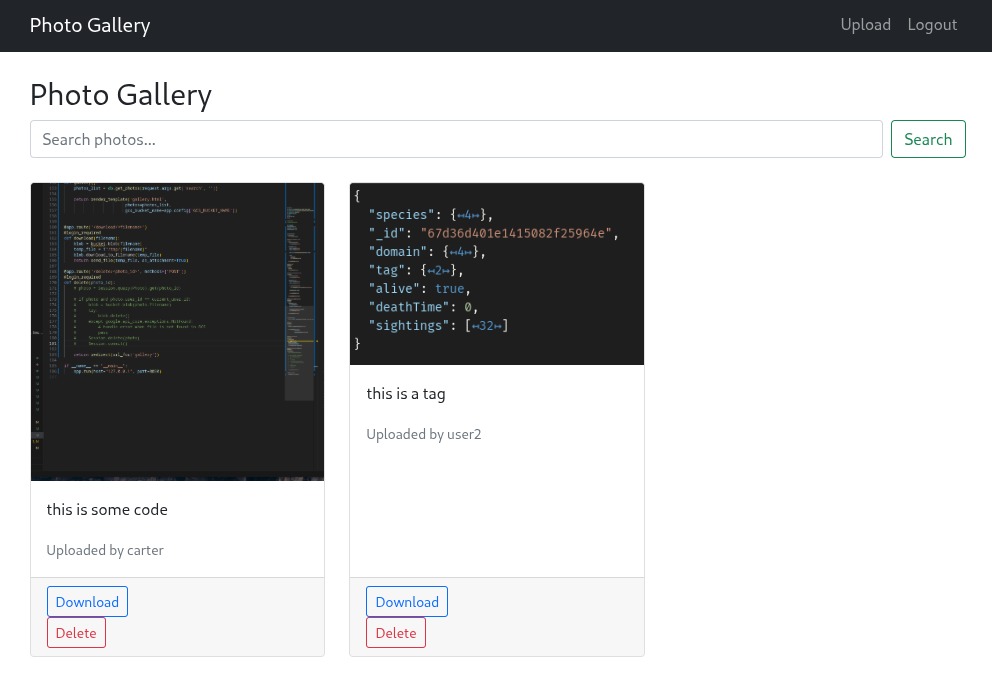
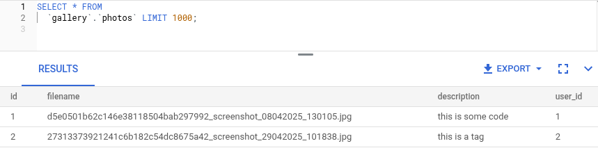
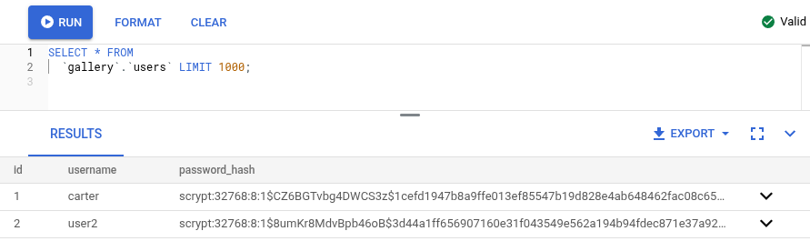

# Simple Gallery App in Flask Using Terraform With GCP

## Project Overview

This is a simple photo gallery web app built with **Flask**, deployed on a **Google Cloud Platform (GCP)** virtual machine, and provisioned using **Terraform**. The app stores uploaded images in a GCS bucket and metadata in a Cloud SQL database.

Infrastructure includes:
- GCE instance running a Flask server
- Cloud SQL for mySQL with Private IP
- GCS bucket for image storage
- VPC, firewall rules, service networking, and IAM bindings

---

## Setup Instructions

1. **Bundle the Flask server into a deployable script**
   ```sh
   cd gallery
   ./bundle.sh
   ```

2. **Create the project using terraform**
   ```sh
   cd ..
   terraform init
   terraform apply
   ```

## Architecture Diagram




# Validation Report

## Terraform Apply Output
```sh
Apply complete! Resources: 10 added, 0 changed, 0 destroyed.

Outputs:

bucket_name = "a0121092-1812-4f83-f40b-2b1893d875db"
bucket_url = "gs://a0121092-1812-4f83-f40b-2b1893d875db"
vm_external_ip = "35.193.151.161"
```

## GCP Console Resources





## Working Application Interface


## Database Connection Test



## Metrics
 - Deployment Time: ~25 Minutes
 - Resource Costs(Monthly): $35.47
   - Compute: $20.56
   - SQL: $9.37
   - Storage: $1.90
   - Networking: $3.65 